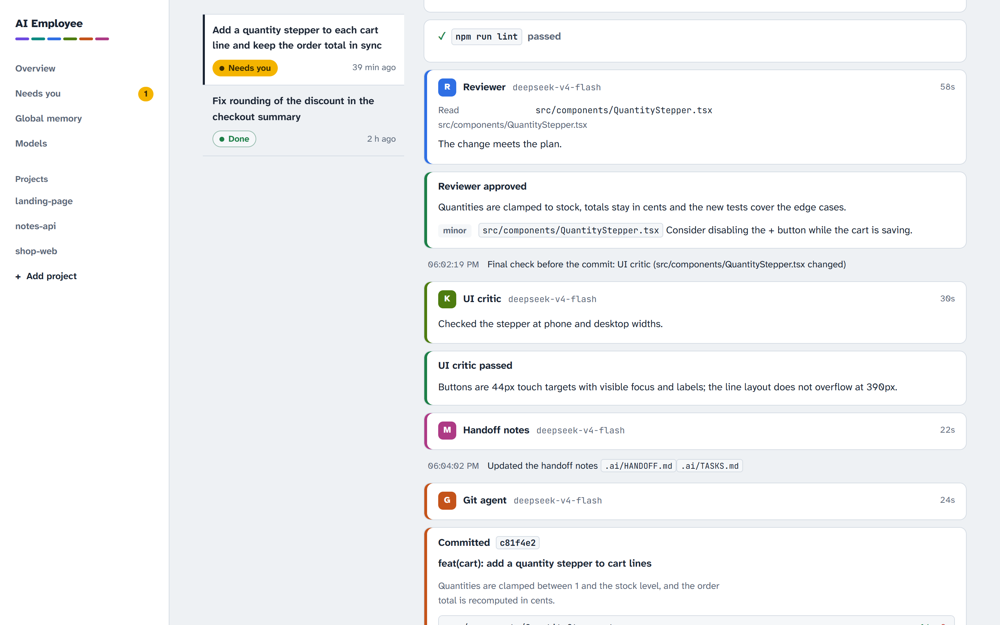
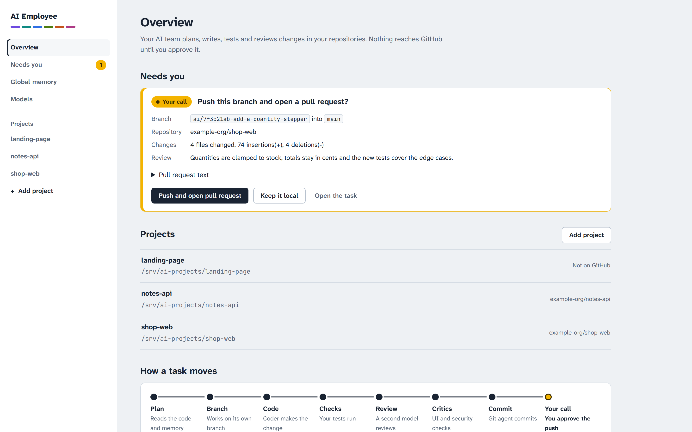
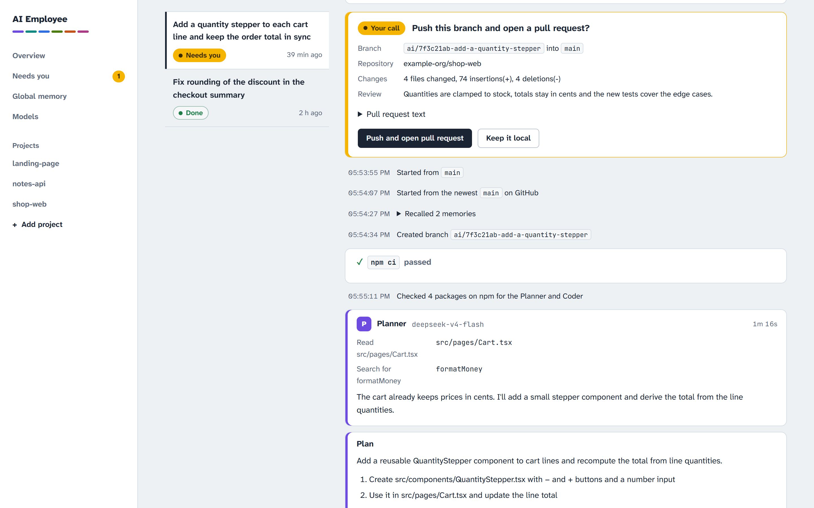
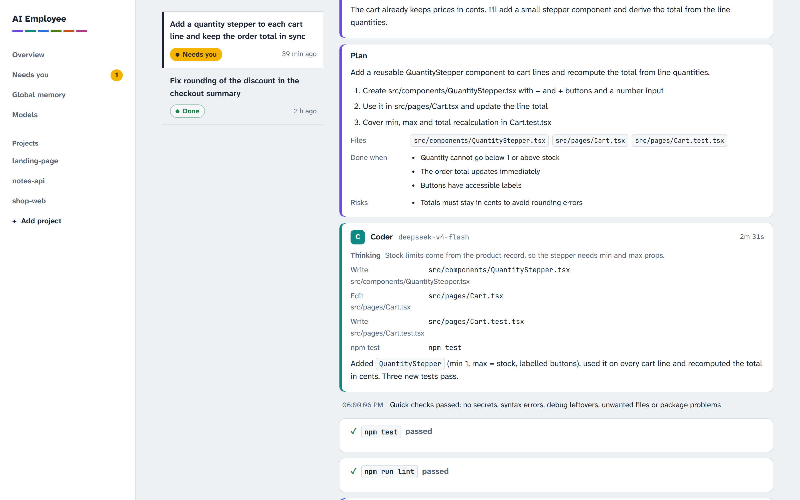
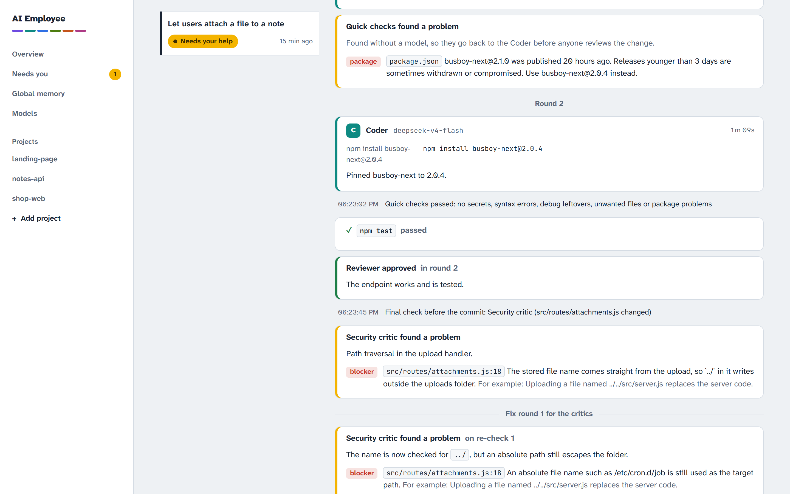
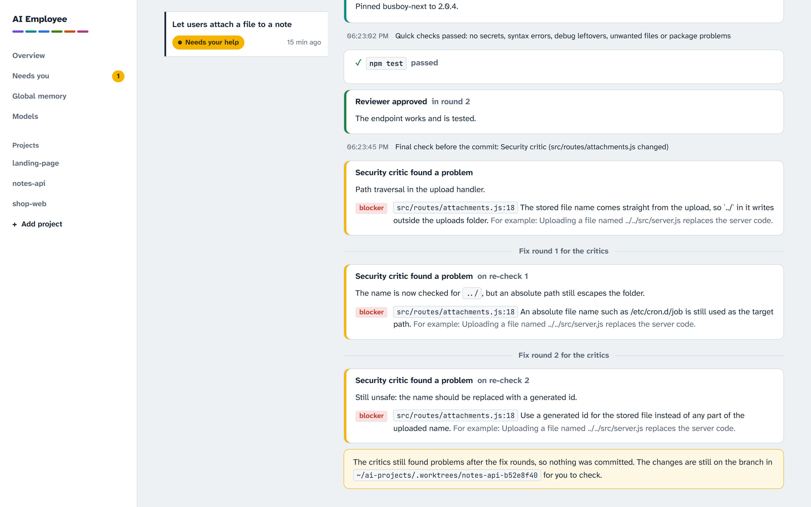
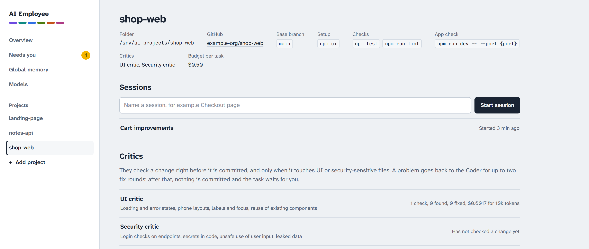
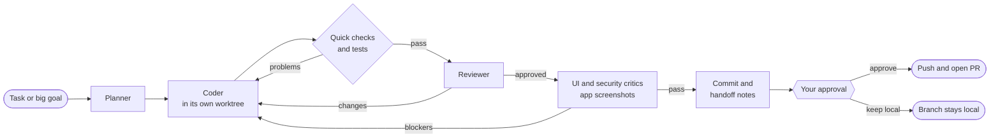

<div align="center">

# AI Employee

**A self-hosted AI engineering team that plans, codes, tests and reviews changes in your own Git repositories, then waits for your approval before anything reaches GitHub.**

[](https://github.com/adnanahamed66772ndpc/ai-employee/actions/workflows/ci.yml)
[](LICENSE)
[](https://nodejs.org)
[](https://www.typescriptlang.org)
[](#project-status)
[](CONTRIBUTING.md)

[Features](#features) · [Screenshots](#screenshots) · [How it works](#how-it-works) · [Quick start](#quick-start) · [Server setup](#run-it-on-a-server) · [Security](#security)

<br>

<picture>
  <source media="(prefers-color-scheme: dark)" srcset="docs/images/run-log-dark.png">
  
</picture>

<sub>The live run log of one task. All screenshots use made-up demo projects.</sub>

</div>

---

## Why AI Employee?

Coding agents are good at writing code and bad at knowing when they are wrong. AI Employee wraps them in the process a careful team already uses:

- **A plan** before any code is written.
- **Free checks first:** tests, linters, a secret scan and a dependency check run before any model reviews the work.
- **Specialist reviews:** a reviewer and critics look at the change before it is committed.
- **A human decision** before anything is pushed.

Everything runs on your own machine or server. The whole "brain" is one SQLite file, there is no cloud account to create, and every model call is metered so a task stops at its budget.

## Features

| | |
|---|---|
| 🧭 **Planner** | Reads the code, the project's handoff notes and team memory, then writes a step-by-step plan with files, acceptance criteria and risks. |
| 🛠️ **Coder** | [DeepSeek Harness](https://github.com/deepseek-ai/deepseek-harness) over ACP, working in the task's own Git worktree. It can only write inside that worktree. |
| ⚡ **Quick checks** | Secrets, broken JSON/YAML/JavaScript, debug leftovers, unwanted files and risky dependencies are caught **without a model call**, and go straight back to the Coder. |
| 📦 **Current package versions** | Before planning, the npm registry says which packages have newer releases or are deprecated. New dependencies must be stable, at least 3 days old and free of known advisories. |
| 🔍 **Reviewer** | A separate read-only session checks requirements, crashes, frontend and backend agreement, and tests, for up to 3 rounds. |
| 🛡️ **UI and security critics** | A final check before the commit, only when the change touches UI or security-sensitive files. The UI critic can start your app and judge real phone and desktop screenshots. |
| ✅ **You approve** | The Git agent writes the commit and pull request. The branch is **pushed only after you click approve** in the dashboard. |
| 🧠 **Memory and handoff notes** | Lessons are saved as project or global memory, and each repository's `.ai/` notes are updated in the same commit. |
| 🗺️ **Big goals** | "Build an online shop" becomes epics you approve. Each epic runs as small tasks on its own branch and becomes one pull request. |
| 🔌 **Any model provider** | OpenAI, Anthropic, Google Gemini, DeepSeek, OpenRouter, Groq, Mistral, xAI, Ollama or any OpenAI-compatible API. Add providers and keys on the Models page and pick a provider and model for each agent. |
| 💸 **Cost control** | Tokens and cost for every agent run, a budget per task, a daily budget for all projects, and one retry with a stronger model when the cheap one gets stuck. |
| 🚀 **Deploy panel** | Set GitHub Actions secrets from the dashboard and let the team write a matrix build-and-deploy workflow. |

## Screenshots

<table>
  <tr>
    <td width="50%" valign="top">
      
      <p align="center"><b>Overview</b><br><sub>What needs you, your projects, and how a task moves.</sub></p>
    </td>
    <td width="50%" valign="top">
      
      <p align="center"><b>Your call</b><br><sub>Push and open the pull request, or keep the branch local.</sub></p>
    </td>
  </tr>
  <tr>
    <td width="50%" valign="top">
      
      <p align="center"><b>Plan and code</b><br><sub>Every file read, edit and command the agents run.</sub></p>
    </td>
    <td width="50%" valign="top">
      
      <p align="center"><b>Quick checks</b><br><sub>A too-new dependency is sent back before any model review.</sub></p>
    </td>
  </tr>
  <tr>
    <td width="50%" valign="top">
      
      <p align="center"><b>Critics</b><br><sub>The security critic holds back a path traversal bug.</sub></p>
    </td>
    <td width="50%" valign="top">
      
      <p align="center"><b>Project</b><br><sub>Checks, app check, budget and what each critic has found.</sub></p>
    </td>
  </tr>
</table>

## How it works



- **One process, one brain.** The Node server owns `data/brain.db` (SQLite with FTS5 search through Node's built-in `node:sqlite`). Projects, tasks, events, approvals, costs and memory all live there. Back it up by copying one file; the server also makes a nightly copy.
- **Isolated work.** Every task gets its own Git worktree, so tasks can run side by side and your project checkout is never edited.
- **Metered models.** Agents call models through the server's local gateway. The gateway adds the provider's API key, records tokens and cost, and refuses calls once a budget is reached. Prices come from your own entry, the provider's model list, or a public price list.
- **Scoped memory.** Agents reach memory through a local MCP endpoint that only exposes global memory plus the current project's memory.
- **Your choice of models.** Set up providers on the **Models** page, then choose a provider and model for each agent, the stronger retry and the screenshot model. The server writes DeepSeek Harness's settings for you. A fresh install starts with CheaperInference: `deepseek-v4-flash` for every agent, `deepseek-v4-pro` for the retry and `glm-5.3-flash` for screenshots.

The full design (components, task lifecycle, security layers and data) is in [docs/ARCHITECTURE.md](docs/ARCHITECTURE.md).

## Quick start

### Requirements

- **Node.js** 22.13 or newer (tested on 22 and 24)
- **git**, and the **GitHub CLI** (`gh`) logged in, for pull requests
- An **API key** from any supported model provider (or a local Ollama)

### 1. Install and run

```bash
git clone https://github.com/adnanahamed66772ndpc/ai-employee.git
cd ai-employee
npm install
cp .env.example .env.local
npm run build        # builds the dashboard
npm start            # http://127.0.0.1:7717
```

`.env.local` is git-ignored and holds optional server settings. You don't need to put an API key there.

### 2. Add a model provider

1. Open **http://127.0.0.1:7717** and go to **Models**.
2. Choose **Add provider** and start from a preset: OpenAI, Anthropic, Google Gemini, DeepSeek, OpenRouter, CheaperInference, Groq, Mistral, xAI, Together AI or Ollama. Any other OpenAI-compatible API works with its base URL.
3. Paste the provider's API key and choose **Test**. The key is encrypted on the server (AES-256-GCM) and never shown again. Agents never see it: their calls go through the server's gateway, which adds the key.
4. Under **Agents**, choose a provider and model for each agent, then pick the stronger retry and screenshot models under **Spending**. The model field suggests the provider's own model list.

The encryption secret is created in `data/secret.key` on first start. Keep it with your backups of `data/`, or set `AI_EMPLOYEE_SECRET_KEY` instead; without it, saved keys have to be entered again.

### 3. Add a project

Choose **Add project**. You can pick a folder, clone one of your GitHub repositories, or create a new one.

## Using it

1. **Add a project.** Optionally set:
   - a setup command, such as `npm ci`, run in each task's fresh worktree;
   - test and lint commands;
   - a start command and address for the app check;
   - a budget per task.

   A project without `.ai/` notes gets the handoff template as a commit on its base branch.
2. **Start a session** on the project page and describe a task. For something large, choose **Big goal**: approve the epic list, then approve each epic's pull request as it finishes.
3. **Watch the run log** as the task moves from plan to code, checks, review, critics and commit, including what it costs.
4. **Decide.** Approve to push the branch and open the pull request, or keep it local.
5. **If a task gets stuck**, continue it with a note: the earlier work stays, and a fresh Coder picks up from there.
6. **Edit what the agents remember** on the project page (project memory) or under **Global memory**.

## Configuration

All settings live in `.env.local`. See [.env.example](.env.example) for every option.

| Variable | Default | What it does |
|---|---|---|
| `AI_EMPLOYEE_SECRET_KEY` | `data/secret.key` | 32-byte secret (base64 or hex) that encrypts provider keys saved on the Models page |
| `CHEAPERINFERENCE_API_KEY` | none (optional) | Imported once as the CheaperInference provider's encrypted key; manage keys on the Models page afterwards |
| `AI_EMPLOYEE_PORT` | `7717` | Dashboard and API port (listens on `127.0.0.1` only) |
| `AI_EMPLOYEE_DATA_DIR` | `./data` | Where `brain.db` and the nightly backups live |
| `AI_EMPLOYEE_PROJECTS_DIR` | `~/ai-projects` | The only folder projects are added from |
| `AI_EMPLOYEE_AGENT_USER` | none | Run agents and checks as this unprivileged Linux user (recommended on servers) |
| `AI_EMPLOYEE_MAX_TASKS` | `1` | Tasks that may run at the same time (at most 8) |
| `AI_EMPLOYEE_PUBLIC_URL` | none | Public dashboard URL behind a reverse proxy; requires a password |
| `AI_EMPLOYEE_TELEGRAM_BOT_TOKEN`, `AI_EMPLOYEE_TELEGRAM_CHAT_ID` | none | Telegram notifications when a task needs you |

## Run it on a server

This setup is tested on Ubuntu 24.04 with nginx and pm2. Run these steps once as the server user:

```bash
git clone https://github.com/adnanahamed66772ndpc/ai-employee.git ~/ai-employee && cd ~/ai-employee
npm ci && cp .env.example .env.local
npm run setup:dsh                            # first DeepSeek Harness settings; the server keeps them up to date
sudo bash scripts/vps/setup-agent-user.sh    # unprivileged "aiagent" user and /srv/ai-projects
npm run set-password                         # dashboard login
```

In `.env.local`, set `AI_EMPLOYEE_AGENT_USER=aiagent` and `AI_EMPLOYEE_PUBLIC_URL=https://ai.your-domain.com`.

The header of [`deploy/nginx/ai-employee.conf`](deploy/nginx/ai-employee.conf) has the steps to:
- get a certificate;
- install the nginx site (this also works with Cloudflare in Full (strict) mode).

| Mode | Command | nginx upstream |
|---|---|---|
| Production | `npm run build && pm2 start deploy/pm2/prod.config.cjs`, then `pm2 save` and `pm2 startup` | `7717` |
| Development | `pm2 start deploy/pm2/dev.config.cjs` (server restarts on changes, dashboard hot-reloads) | `5173` |

- **Updating:** `git pull`, `npm ci` if dependencies changed, `npm run build`, then `pm2 restart ai-employee`. Restart only while no task is running.
- **Telegram:** create a bot with @BotFather and put its token in `.env.local`. Send the bot a message, run `npm run telegram:chat-id`, add the chat id it prints, and restart the server. Test it from the **Models** page.
- **Models:** add providers and keys on the Models page. The agent user's DeepSeek Harness settings link to a copy the server keeps up to date, so model changes need no restart.

## Security

AI Employee gives AI agents a shell, so it is built to contain them:

- **Local-only server.** It listens on `127.0.0.1` and rejects cross-site requests. The memory endpoint and model gateway answer direct local requests only, and nginx returns 404 for them.
- **Sandboxed agents.** Agents run inside DeepSeek Harness's sandbox (Landlock or bwrap on Linux). The Planner, Reviewer, critics, Git and memory agents are read-only. The Coder can only write inside its task worktree. Requests for wider access are always rejected.
- **A separate Linux user on servers.** Agents run with no sudo, docker, GitHub credentials or model API key. Project checkouts and `.git` folders are closed to them, and repository hooks never run. **Without the agent user, the sandbox cannot stop an agent from using your Git credentials.**
- **No telemetry.** DeepSeek Harness telemetry is disabled (`DSH_TELEMETRY_MODE=DISABLED`).
- **Secrets stay out.** Secrets are blocked from memory, handoff notes and commits. Deploy secrets go straight to GitHub and are never stored.
- **Nothing is pushed without your approval**, and you should still review every pull request before merging.

Found a vulnerability? Please report it privately; see [SECURITY.md](SECURITY.md).

## Project layout

| Path | What it is |
|---|---|
| `apps/server` | Hono API, live event stream, brain MCP endpoint, model gateway, task pipeline, critics, quick checks, notifications |
| `apps/dashboard` | Vite + React dashboard |
| `packages/brain` | SQLite schema and migrations, memory search, tasks, events, approvals, usage |
| `packages/dsh-client` | ACP client that runs `dsh --profile acp` |
| `packages/git` | Git and GitHub CLI helpers, task worktrees |
| `scripts/` | DeepSeek Harness setup, a keyless ACP smoke test, password and Telegram helpers, VPS agent user setup |
| `deploy/` | nginx site template and pm2 configs |
| `docs/` | [Architecture](docs/ARCHITECTURE.md) and the README screenshots |

## Development

```bash
npm run dev              # API server with watch, http://127.0.0.1:7717
npm run dev:dashboard    # dashboard with hot reload, http://localhost:5173
npm run typecheck        # all workspaces
npm test                 # vitest: brain, git, server (fake agents, no API key needed), dashboard
npm run build            # dashboard production build
```

## Project status

AI Employee is a **developer preview**. It is used daily, but its interfaces and database may still change between commits. DeepSeek Harness is also a developer preview (see its SAFETY.md). Keep backups of `data/brain.db`, and review every pull request before merging.

## Author

AI Employee is built and maintained by **Adnan Ahamed**, web developer and software engineer.

- Website: [adnanahamedhimal.com](https://adnanahamedhimal.com)
- GitHub: [@adnanahamed66772ndpc](https://github.com/adnanahamed66772ndpc)

## Contributing

Contributions are welcome. Read [CONTRIBUTING.md](CONTRIBUTING.md) for setup, checks and the pull request process. Every pull request is reviewed by the maintainer before it is merged.

## License

[MIT](LICENSE) © 2026 [Adnan Ahamed](https://adnanahamedhimal.com)
